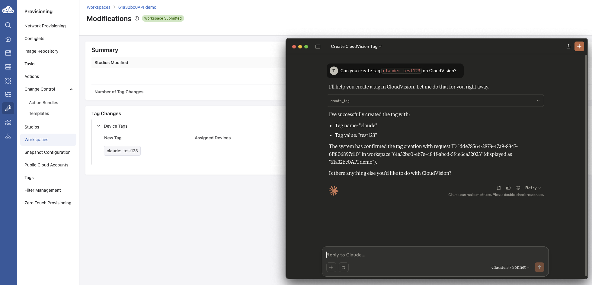

# MCP Server Demo with Arista CloudVision

> [!WARNING]
> Please note that this is not officially supported by Arista.
>
> You might not want to do this in your production environment as it is not using a local LLM.
>


Kudos to [@noredistribution](https://github.com/noredistribution). This demo is almost entirely built on their work with few small modifications to make it work for me.

Any API call can be added very easy with the `@mcp.tool()` decorator.

To learn more about MCP please visit [https://modelcontextprotocol.io/introduction](https://modelcontextprotocol.io/introduction).

## Example usage

1\. Create a .env file like the following and place it in this directory.

```bash
CVPTOKEN="Insert CloudVision Service account token here"
CVP="www.arista.io"
```

2\. Start the MCP server as follows 

````bash 
uv init
uv venv
source .venv/bin/activate
uv run mcp_server_rest.py
```` 

Note: the `uv --directory` flag may need to be used if running uv from a different root directory, where [directory] is the directory that uv was initiated in i.e this directory.

```bash
uv --directory [directory] run mcp_server_rest.py
```

3\. Uee your favorite LLM and start prompting



## How to generate service account tokens

Service accounts can be created from the Settings page where a service token can be generated as seen below:


